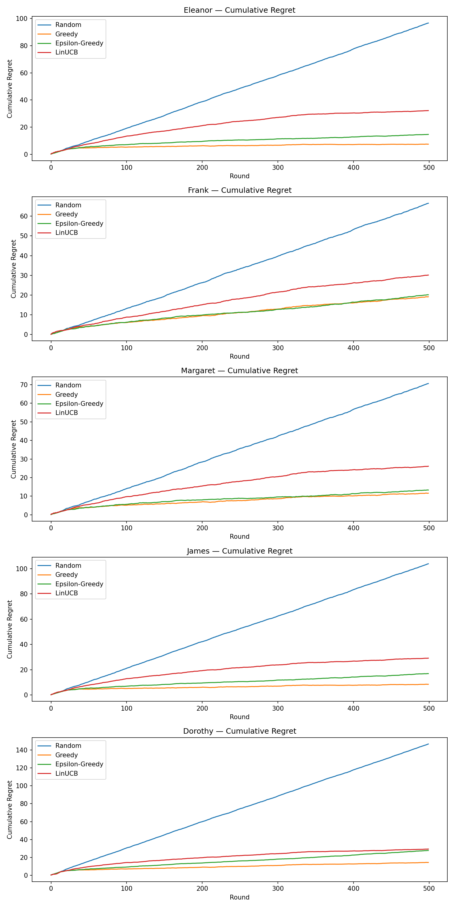

# Image Personalization Prototype

A photo recommendation prototype that learns which images each user prefers, built as a technical assessment for a startup.

The goal: people living with dementia respond differently to different kinds of photos. Some find calm, warm indoor scenes soothing, while others light up at busy family gatherings. This project explores how a system could learn each person's preferences over time instead of showing everyone the same images.

> **Note:** This is a standalone prototype built for an assessment. It is not deployed in any product, and all user profiles are simulated.



---

## How It Works

The pipeline has four stages, one notebook each:

### 1. Feature Extraction (`01_feature_extraction.ipynb`, `extract_images.py`)
Each photo in `images/` is sent to the **Anthropic Claude API**, which returns a structured JSON description with 8 features:

| Feature | Example values |
|---|---|
| `num_people` | 0, 1, 4 |
| `age_brackets` | child, adult, older adult |
| `setting` | indoor, outdoor |
| `color_temperature` | warm, cool, neutral |
| `brightness` | bright, moderate, dim |
| `nature_present` | water, plants, animals |
| `time_of_day` | morning, afternoon, evening |
| `scene_type` | beach, garden, city street |

Results are saved to `image_features.json`.

### 2. Personas (`02_personas.ipynb`, `personas.json`)
Five simulated user profiles, each with different preference weights:

| Persona | Prefers |
|---|---|
| Eleanor | Bright, warm outdoor nature scenes with children |
| Frank | Cool-toned urban waterfront scenes |
| Margaret | Close-up garden and flower scenes in golden light |
| James | Bright social gatherings with people of all ages |
| Dorothy | Calm, dim, warm-toned indoor spaces |

### 3. Response Simulator (`03_simulator.ipynb`, `simulator.py`)
Since there are no real users, the simulator stands in for them. For each persona and image, it:
1. Converts the image's features into an 18-dimension numeric vector
2. Scores it against the persona's preference weights
3. Rescales the score to a 0 to 1 range
4. Adds Gaussian noise (standard deviation 0.3) so feedback is realistic rather than perfect

### 4. Contextual Bandit (`04_bandit.ipynb`, `bandit.py`)
Four recommendation strategies compete to find each persona's favorite images:

| Policy | Strategy |
|---|---|
| **Random** | Picks any image, never learns |
| **Greedy** | Tries each image once, then always picks the best so far |
| **Epsilon-Greedy** | Like Greedy, but explores a random image 10% of the time |
| **LinUCB** | Learns a model of each image's appeal and balances trying new images with picking proven ones |

Each policy runs for **500 rounds** per persona, averaged over **20 trials**. Performance is measured by **cumulative regret**: the gap between the score of the image a policy chose and the best possible image, as determined by an oracle that knows each persona's true preferences.

---

## Setup

**1) Install dependencies**
```bash
pip install anthropic numpy matplotlib jupyter
```

**2) Add your Anthropic API key**
```bash
export ANTHROPIC_API_KEY="your-key-here"
```

**3) Run the notebooks in order**
```bash
jupyter notebook
```
Open and run `01_feature_extraction.ipynb` through `04_bandit.ipynb`.

---

## Tools
Python, Anthropic Claude API, NumPy, Matplotlib, Jupyter Notebook
